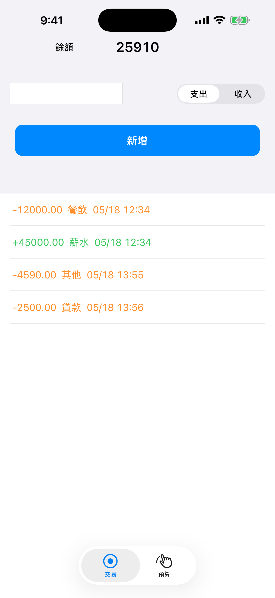
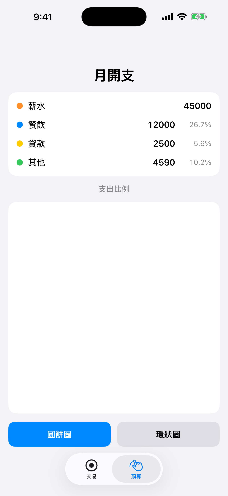
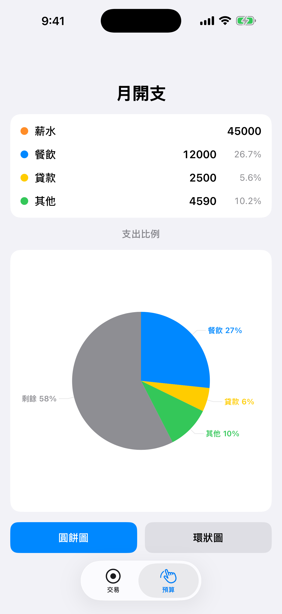
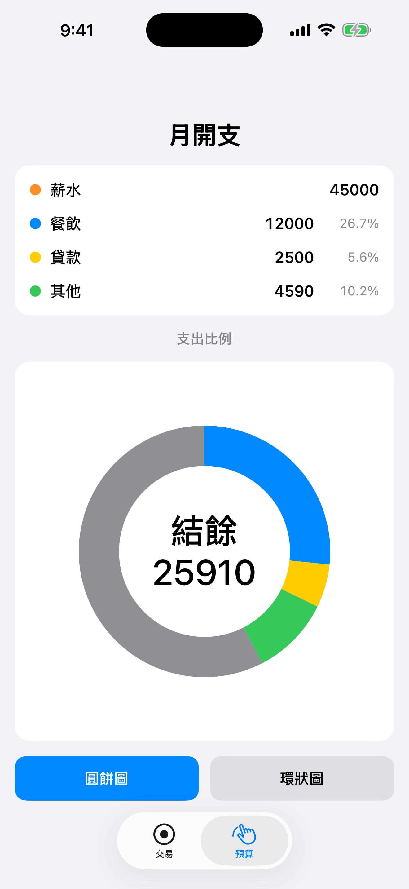

# Demo_018 — 記帳 App

UIKit + Swift 練習作。用 `UIBezierPath` 自繪圓餅圖／環狀圖，加 leader lines 標示分類百分比。

## 畫面

| 交易頁 | 預算頁（summary） |
| :---: | :---: |
|  |  |

| 預算頁 ＋ 圓餅圖 | 預算頁 ＋ 環狀圖 |
| :---: | :---: |
|  |  |

## 架構

- `Transaction` / `TransactionCategory` / `TransactionType` — Model
- `TransactionStore` — 單一資料來源，UserDefaults 持久化，`NotificationCenter` 廣播變更
- `PieChartView` / `DonutChartView` — 自繪 `UIView`，自動依 bounds 自適應大小與線寬
- `TransactionViewController` — 新增／刪除交易、顯示餘額
- `ViewController`（預算 dashboard）— 依 `TransactionStore` 加總按分類顯示，並繪製圓餅／環狀圖

兩個分頁透過 `TransactionStore` 解耦，沒有互相認識；資料變動由 store 廣播給所有訂閱者。
